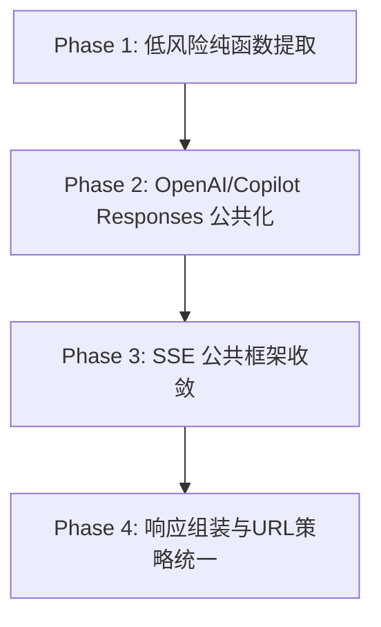

# type/function 重复代码优化执行计划（F1~F8）

> 适用范围：`crates/rocode-provider/src/protocols/*`
> 
> 基线说明：当前子 worktree 中未发现 `doc/type-function-duplication-assessment-2026-03.md`，本计划基于仓库现状进行复核映射，并按 F1~F8 给出可执行落地方案。

## 1) 全量问题映射（F1~F8）

| ID | 问题描述（重复点） | 证据（crate/文件） | 风险 | 优先级 |
|---|---|---|---|---|
| F1 | `runtime_pipeline_enabled` 逻辑在多个协议实现重复（配置读取 + 环境变量解析） | `protocols/openai.rs`、`anthropic.rs`、`google.rs`、`vertex.rs`、`copilot.rs`、`gitlab.rs` | 低 | P0 |
| F2 | `resolve_with_fallback` 通用主/备路由包装重复 | `protocols/openai.rs`、`copilot.rs` | 低 | P1 |
| F3 | `tools_to_input_tools` 工具定义到 `InputTool::Function` 的转换重复 | `protocols/openai.rs`、`copilot.rs` | 低 | P1 |
| F4 | `responses_url`（base_url/path 归一化）重复且行为存在轻微差异风险 | `protocols/openai.rs`、`copilot.rs` | 中 | P1 |
| F5 | `*_reasoning_effort` 变体映射逻辑重复（low/medium/high/max） | `protocols/openai.rs`、`copilot.rs` | 低 | P1 |
| F6 | SSE drain 模式重复（buffer + newline + flush） | `protocols/google.rs`、`vertex.rs`、`copilot.rs`、`gitlab.rs`、`openai.rs(legacy)` | 中 | P2 |
| F7 | 各 provider `convert_*_response` 中 usage/choice 组装样板重复 | `protocols/google.rs`、`vertex.rs`、`copilot.rs`、`gitlab.rs`、`bedrock.rs` | 中 | P2 |
| F8 | URL 构造函数分散，协议内重复处理尾斜杠/路径拼接 | `protocols/anthropic.rs`、`openai.rs`、`copilot.rs`、`gitlab.rs`、`vertex.rs` | 中 | P3 |

---

## 2) 分阶段实施策略（4+阶段，含依赖）

### Phase 1（P0，低风险）：开关与映射类重复收敛
- 覆盖：F1、F5（可并行准备 F2/F3）
- 目标：提取无副作用 helper，先减少“同逻辑多处实现”。
- 依赖：无（可作为首批改造）

### Phase 2（P1，中低风险）：OpenAI/Copilot Responses 侧通用化
- 覆盖：F2、F3、F4
- 目标：抽象 `resolve_with_fallback`、`tools_to_input_tools`、`responses_url`。
- 依赖：Phase 1 helper 风格与目录结构稳定。

### Phase 3（P2，中风险）：SSE 解析骨架合并
- 覆盖：F6
- 目标：将 drain/line-flush 框架提取为通用器，协议仅保留 `parse_*`。
- 依赖：Phase 2 完成后统一错误处理风格，减少迁移冲突。

### Phase 4（P3，中风险）：响应组装与 URL 策略统一
- 覆盖：F7、F8
- 目标：统一 `ChatResponse` builder 与 URL join policy。
- 依赖：Phase 3 完成，确保 streaming 与非 streaming 行为回归稳定。

---

## 3) 各阶段具体改造任务（crate/文件粒度）

### Phase 1 任务清单
1. `crates/rocode-provider/src/protocols/mod.rs`
   - 新增 `runtime_pipeline_enabled` 公共 helper。
   - 新增 env 解析纯函数与单元测试。
2. `crates/rocode-provider/src/protocols/{openai,anthropic,google,vertex,copilot,gitlab}.rs`
   - 删除重复本地实现，改为调用 `super::runtime_pipeline_enabled`。
3. （可选）在 `mod.rs` 新增 `reasoning_effort_from_variant` 雏形（对应 F5）。

### Phase 2 任务清单
1. 新建 `crates/rocode-provider/src/protocols/responses_common.rs`
   - 抽象 `resolve_with_fallback`。
   - 抽象 `tools_to_input_tools`。
   - 抽象 `responses_url`（可注入 provider host/path strategy）。
2. `openai.rs` / `copilot.rs`
   - 迁移到公共模块并补差异化测试（base_url 边界）。

### Phase 3 任务清单
1. 新建 `crates/rocode-provider/src/protocols/sse_common.rs`
   - 提供 `drain_sse_events(buffer, flush, parse_line)` 框架。
2. `google.rs` / `vertex.rs` / `copilot.rs` / `gitlab.rs` / `openai.rs`
   - 仅保留 provider 特有 `parse_*`，复用统一 drain 框架。

### Phase 4 任务清单
1. 新建 `crates/rocode-provider/src/protocols/response_common.rs`
   - 抽象 usage/choice 基础 builder。
2. 新建 `crates/rocode-provider/src/protocols/url_common.rs`
   - 统一 base_url join/trim 策略，保留 provider 特有 endpoint 模板。
3. 各协议文件迁移并进行协议级快照回归。

---

## 4) 风险与回滚策略

### 主要风险
1. **行为漂移风险（中）**：公共函数替换后与历史边界行为不一致（尤其 URL 拼接、SSE flush）。
2. **协议差异被过度抽象（中）**：OpenAI/Copilot/Vertex 对 endpoint 与 finish_reason 语义不同。
3. **测试盲区（中）**：仅做单测无法覆盖真实 provider 返回体差异。

### 回滚策略
1. **按阶段小步提交**：每个 F 项独立 commit，便于 `git revert <hash>` 精确回滚。
2. **保留兼容层**：Phase 2~4 先“引入公共函数 + 旧路径并存”，通过开关切流。
3. **失败快速止损**：若集成回归失败，优先回滚最新公共抽象层，不动业务协议逻辑。

---

## 5) 测试与验证矩阵

| 维度 | 目标 | 用例类型 | 重点文件 |
|---|---|---|---|
| 单元测试 | helper 语义稳定 | `#[test]` | `protocols/mod.rs`, 新增 `*_common.rs` |
| 集成测试 | 协议请求/响应兼容 | provider 集成测试 | `crates/rocode-provider/tests/*` |
| 回归测试 | 历史行为不退化 | SSE/URL/finish_reason 回归 | `protocols/*` 对应 test 模块 |
| 兼容性测试 | 多 provider 一致性 | 协议路由/格式测试 | `protocol_test.rs`, `protocol_routing_test.rs`, `v2_compliance.rs` |

建议最低执行顺序：
1. `cargo test -p rocode-provider protocols::`
2. `cargo test -p rocode-provider --tests`
3. `cargo check -p rocode-provider`

---

## 6) 验收标准（DoD）与里程碑

### DoD（每个 F 项）
1. 重复逻辑至少减少一个独立实现点。
2. 新增或更新测试，覆盖新增公共函数关键分支。
3. `rocode-provider` 相关 check/test 通过。
4. 变更可独立回滚，提交说明包含“why”。

### 里程碑
- M1：Phase 1 完成（F1 落地，F5 设计完成）
- M2：Phase 2 完成（F2/F3/F4 收敛）
- M3：Phase 3 完成（F6 收敛）
- M4：Phase 4 完成（F7/F8 收敛，兼容回归通过）

---

## 7) 分支与提交策略（建议）

### 分支策略
- 当前子 worktree 分支：保持单一主题（`type-function-dup`）持续小步提交。
- 不在本任务中 push/merge，仅保持可合并状态。

### 提交策略
- 每次提交只覆盖一个可验证子目标：
  1. `refactor(provider): centralize runtime pipeline toggle parsing`
  2. `refactor(provider): share responses fallback and tool mapping`
  3. `refactor(provider): extract generic SSE drain loop`
  4. `refactor(provider): unify response/url builders`
- Commit message 强调 why：降低行为分叉与维护成本、减少协议实现漂移。

---

## 本次已启动执行（目标B首批低风险）

- 已优先落地 **F1**：将 6 处 `runtime_pipeline_enabled` 重复实现收敛至 `protocols/mod.rs`，并新增单测。
- 下一批建议：F5（reasoning effort 映射收敛）或 F3（tools 转换收敛）。
